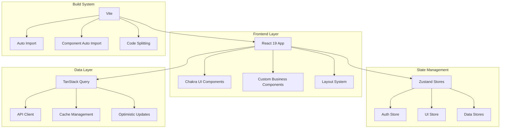

# Design Document

## Overview

The modern admin dashboard will transform the existing basic React application into a comprehensive management system. The design leverages the current monorepo structure while introducing Chakra UI as the primary design system, Zustand for state management, and TanStack Query for data operations. The architecture emphasizes modularity, performance, and maintainability while providing a rich user experience across all devices.

## Architecture

### High-Level Architecture



### Technology Stack Integration

- **React 19**: Core framework with concurrent features and automatic batching
- **Chakra UI**: Complete design system replacing custom CSS components
- **Zustand**: Lightweight state management for global application state
- **TanStack Query**: Server state management with caching and synchronization
- **TypeScript**: Strict type checking with enhanced developer experience
- **Vite**: Build tool with auto-import plugins for seamless development

## Components and Interfaces

### Core Layout Components

#### AdminLayout
```typescript
interface AdminLayoutProps {
  children: React.ReactNode;
  title?: string;
  breadcrumbs?: BreadcrumbItem[];
  actions?: React.ReactNode;
}
```

The main layout component providing:
- Responsive sidebar navigation
- Header with user profile and notifications
- Main content area with breadcrumbs
- Mobile-optimized drawer navigation

#### Sidebar Navigation
```typescript
interface NavigationItem {
  id: string;
  label: string;
  icon: IconType;
  path: string;
  children?: NavigationItem[];
  permissions?: string[];
}
```

Features:
- Hierarchical menu structure
- Permission-based visibility
- Active state management
- Collapsible sections

### Data Management Components

#### DataTable
```typescript
interface DataTableProps<T> {
  data: T[];
  columns: ColumnDef<T>[];
  loading?: boolean;
  pagination?: PaginationConfig;
  sorting?: SortingConfig;
  filtering?: FilterConfig;
  selection?: SelectionConfig;
  actions?: TableAction<T>[];
}
```

Advanced table component with:
- Server-side pagination, sorting, filtering
- Bulk operations with multi-select
- Inline editing capabilities
- Export functionality
- Responsive column management

#### FormBuilder
```typescript
interface FormBuilderProps {
  schema: FormSchema;
  initialValues?: Record<string, any>;
  onSubmit: (values: Record<string, any>) => Promise<void>;
  validation?: ValidationSchema;
  layout?: 'vertical' | 'horizontal' | 'grid';
}
```

Dynamic form generation with:
- Schema-driven form creation
- Real-time validation
- Conditional field visibility
- File upload handling
- Auto-save functionality

### Visualization Components

#### Dashboard Widgets
```typescript
interface WidgetProps {
  type: 'chart' | 'metric' | 'table' | 'custom';
  config: WidgetConfig;
  data?: any;
  loading?: boolean;
  error?: string;
}
```

Modular dashboard widgets supporting:
- Multiple chart types (line, bar, pie, area)
- Key performance indicators
- Real-time data updates
- Interactive drill-down
- Customizable layouts

## Data Models

### User Management
```typescript
interface User {
  id: string;
  email: string;
  name: string;
  avatar?: string;
  roles: Role[];
  permissions: Permission[];
  status: 'active' | 'inactive' | 'pending';
  lastLogin?: Date;
  createdAt: Date;
  updatedAt: Date;
}

interface Role {
  id: string;
  name: string;
  description: string;
  permissions: Permission[];
}

interface Permission {
  id: string;
  resource: string;
  action: 'create' | 'read' | 'update' | 'delete';
  conditions?: Record<string, any>;
}
```

### Application State
```typescript
interface AppState {
  auth: AuthState;
  ui: UIState;
  data: DataState;
}

interface AuthState {
  user: User | null;
  token: string | null;
  permissions: Set<string>;
  isAuthenticated: boolean;
  isLoading: boolean;
}

interface UIState {
  sidebarCollapsed: boolean;
  theme: 'light' | 'dark';
  notifications: Notification[];
  modals: ModalState[];
  breadcrumbs: BreadcrumbItem[];
}
```

### API Response Models
```typescript
interface ApiResponse<T> {
  data: T;
  message?: string;
  success: boolean;
  timestamp: string;
}

interface PaginatedResponse<T> {
  data: T[];
  pagination: {
    page: number;
    limit: number;
    total: number;
    totalPages: number;
  };
}
```

## Error Handling

### Error Boundary Strategy
- Global error boundary for unhandled exceptions
- Route-level error boundaries for page-specific errors
- Component-level error boundaries for critical widgets
- Graceful degradation with fallback UI components

### API Error Management
```typescript
interface ApiError {
  code: string;
  message: string;
  details?: Record<string, any>;
  timestamp: string;
}

interface ErrorHandlingConfig {
  retryAttempts: number;
  retryDelay: number;
  showNotification: boolean;
  fallbackComponent?: React.ComponentType;
}
```

Error handling features:
- Automatic retry with exponential backoff
- User-friendly error messages
- Contextual error recovery options
- Error logging and reporting
- Offline state management

### Form Validation
- Real-time field validation
- Cross-field validation rules
- Async validation for unique constraints
- Custom validation messages
- Accessibility-compliant error presentation

## Testing Strategy

### Unit Testing
- Component testing with React Testing Library
- Hook testing for custom hooks
- Store testing for Zustand state management
- Utility function testing

### Integration Testing
- API integration testing with MSW (Mock Service Worker)
- Form submission and validation flows
- Navigation and routing scenarios
- Permission-based access control

### E2E Testing
- Critical user journeys
- Cross-browser compatibility
- Mobile responsiveness
- Performance benchmarks

### Testing Tools
- **Vitest**: Fast unit test runner
- **React Testing Library**: Component testing utilities
- **MSW**: API mocking for integration tests
- **Playwright**: End-to-end testing framework

## Performance Optimization

### Code Splitting Strategy
```typescript
// Route-based splitting
const UserManagement = lazy(() => import('./pages/UserManagement'));
const Analytics = lazy(() => import('./pages/Analytics'));

// Component-based splitting
const DataVisualization = lazy(() => import('./components/DataVisualization'));
```

### Optimization Techniques
- React.memo for expensive components
- useMemo and useCallback for expensive calculations
- Virtual scrolling for large data sets
- Image optimization and lazy loading
- Bundle analysis and tree shaking

### Caching Strategy
- TanStack Query for server state caching
- Browser storage for user preferences
- Service worker for offline functionality
- CDN integration for static assets

## Security Considerations

### Authentication & Authorization
- JWT token-based authentication
- Role-based access control (RBAC)
- Permission-based UI rendering
- Secure token storage and refresh

### Data Protection
- Input sanitization and validation
- XSS protection with Content Security Policy
- CSRF protection for state-changing operations
- Secure API communication with HTTPS

### Privacy & Compliance
- Data encryption for sensitive information
- Audit logging for administrative actions
- GDPR compliance for user data handling
- Session management and timeout policies

## Responsive Design Strategy

### Breakpoint System
```typescript
const breakpoints = {
  base: '0px',
  sm: '480px',
  md: '768px',
  lg: '992px',
  xl: '1280px',
  '2xl': '1536px'
};
```

### Mobile-First Approach
- Progressive enhancement from mobile to desktop
- Touch-friendly interface elements
- Optimized navigation for small screens
- Adaptive content layout and typography

### Cross-Device Consistency
- Unified design tokens across all breakpoints
- Consistent interaction patterns
- Synchronized state across device switches
- Optimized performance for all device types